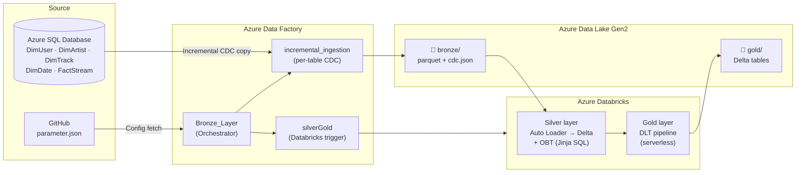

# 🎵 Spotify Azure Data Engineering Project

An end-to-end, cloud-native **ETL/ELT data pipeline** on **Microsoft Azure** that ingests streaming data from an **Azure SQL Database** into a **medallion architecture** (Bronze → Silver → Gold) using **Azure Data Factory**, **Azure Data Lake Storage Gen2**, **Azure Databricks** (Auto Loader, Delta Live Tables) — all provisioned **Infrastructure-as-Code** with **ARM templates**.

---

## 📐 Architecture



---

## 🧭 How data flows through the pipeline

| # | Stage | What happens |
|---|-------|--------------|
| 1 | **Seed source data** | `SQL_DATASETS/spotify_initial_load.sql` populates the Azure SQL database; `spotify_incremental_load.sql` simulates new/changed rows. |
| 2 | **Fetch config** | The orchestrator copies `parameter/parameter.json` from **GitHub** into ADLS `bronze/parameter/` — the single source of truth for *which* tables to ingest and *which* column is their CDC watermark. |
| 3 | **Lookup config** | A `Lookup` activity reads the parameter file so the pipeline knows the schema, table name, and CDC column for every table. |
| 4 | **Loop over tables** | A `ForEach` activity (sequential) invokes the `incremental_ingestion` child pipeline once per table, passing `schema`, `table`, and `cdc`. |
| 5 | **Incremental extract** | The child pipeline reads the last watermark from `bronze/{table}_CDC/cdc.json`, then runs `SELECT * FROM {schema}.{table} WHERE {cdc} > '{last_watermark}'` and lands the rows as **Parquet** in `bronze/{table}/{table}_{timestamp}.parquet`. |
| 6 | **Watermark management** | If rows were copied (`dataRead > 0`), a `Script` activity computes `MAX({cdc})` and the pipeline overwrites `cdc.json` with the new watermark. If zero rows were copied, the empty file is **deleted** to keep bronze clean. |
| 7 | **Trigger transformation** | After every table succeeds, the orchestrator runs the `silverGold` pipeline, which fires a **Databricks Job**. |
| 8 | **Silver layer** | Databricks notebooks use **Auto Loader** (`cloudFiles`) to incrementally ingest bronze Parquet into Delta tables (`spotify_project.silver.*`), then build a **One Big Table (OBT)** by joining dims + fact with a Jinja-templated SQL query. |
| 9 | **Gold layer** | A **Delta Live Tables (DLT)** pipeline (`gold_pipeline`, serverless compute + Photon) refines the silver data into analytics-ready `spotify_project.gold.*` tables. |
| 10 | **Serve** | The `writingBack` notebook streams the gold `dimuser` table back to the ADLS `gold` container for downstream consumption (BI / reporting). |

---

## 🗂️ Repository structure

```
Spotify-DE-Project/
│
├── SQL_DATASETS/
│   ├── spotify_initial_load.sql        # Full seed of the 5 source tables
│   └── spotify_incremental_load.sql    # Simulated new/changed rows (CDC testing)
│
├── parameter/
│   └── parameter.json                  # Table list + CDC columns (fetched from GitHub)
│
├── pipeline/                           # Azure Data Factory pipelines
│   ├── Bronze_Layer.json               # Orchestrator: config → ForEach → Databricks
│   ├── incremental_ingestion.json      # Per-table CDC extract (SQL → Parquet)
│   └── silverGold.json                 # Triggers the Databricks job
│
├── dataset/                            # ADF datasets (parameterized)
│   ├── AzureSqlTableDimArtist.json
│   ├── bronze_data.json
│   ├── cdc.json
│   └── github_connect.json
│
├── linkedService/                      # ADF linked services
│   ├── AzureSqlDatabaseConnector.json
│   ├── AzureDataLakeStorageConnector.json
│   ├── AzureDatabricks1.json
│   └── HttpServer.json
│
├── factory/
│   └── orchestratorspotify.json        # ADF factory definition
│
├── Databricks/
│   ├── job_pipeline/
│   │   └── settings.yml                # DAB bundle: gold DLT pipeline settings
│   ├── silver_layer/
│   │   ├── silver_Dim_fact.dbc         # Auto Loader → silver Delta dim/fact tables
│   │   └── SilverOBT.dbc               # Jinja SQL → One Big Table
│   ├── gold_layer/
│   │   ├── gold_pipeline.zip           # DLT gold pipeline source
│   │   └── writingBack.dbc             # Stream gold.dimuser → ADLS gold container
│   └── databricksARM.json
│
├── ADF_ARM/ADF_ARM.json                # ARM: Data Factory
├── ADLS ARM Template/ADLS_ARM.json     # ARM: Storage (Data Lake Gen2)
├── AccessConnector ARm Temp/
│   └── AccessARM.json                  # ARM: Databricks Access Connector (MI auth)
├── Azure SQL ARM Template/             # ARM: Azure SQL Server + Database
│
├── LICENSE                             # Apache-2.0
└── README.md
```

---

## ☁️ Azure services used

| Service | Role |
|---|---|
| **Azure SQL Database** | Source system (OLTP) holding dimensions + fact table |
| **Azure Data Factory (ADF)** | Orchestration & incremental ingestion (metadata-driven, CDC) |
| **Azure Data Lake Storage Gen2** | Bronze (raw Parquet + watermarks) and Gold (served Delta) storage |
| **Azure Databricks** | Transformation engine — Auto Loader, Delta Lake, DLT |
| **ARM Templates** | Infrastructure-as-Code provisioning of all resources |

---

## 🔁 The incremental (CDC) mechanism

The pipeline is **metadata-driven**: adding a new table to ingest only means adding one JSON object to `parameter/parameter.json` — no pipeline changes needed.

```json
{ "schema": "dbo", "table": "FactStream", "cdc": "stream_timestamp" }
```

For each table the `incremental_ingestion` pipeline:

1. **Reads the watermark** — `Lookup` on `bronze/{table}_CDC/cdc.json`.
2. **Extracts only new/changed rows** — `WHERE {cdc} > '{watermark}'` → Parquet in bronze.
3. **Branches on result**:
   - ✅ `dataRead > 0` → compute `MAX({cdc})` via a `Script` activity → write the new watermark back to `cdc.json`.
   - 🚫 `dataRead = 0` → `Delete` the empty Parquet file (with deletion logging to `bronze/logs/`).
4. **Repeats** for the next table in the `ForEach` loop.

> 💡 Set `"from_date"` in `parameter.json` to force a backfill from a specific date; leave it `""` to use the stored watermark.

---

## 🏗️ Medallion layers in Databricks

| Layer | Storage / catalog | Content |
|---|---|---|
| 🥉 **Bronze** | ADLS `bronze` container — raw Parquet, partitioned by table, plus `_CDC/cdc.json` watermarks | Untouched extracts from Azure SQL |
| 🥈 **Silver** | `spotify_project.silver` — Delta tables (`factstream`, dims) + `obt` | Cleaned, typed, conformed data; **One Big Table** joining user/artist/track/date dims to the fact |
| 🥇 **Gold** | `spotify_project.gold` (DLT) + ADLS `gold` container | Analytics-ready tables served for BI/reporting |

**Silver techniques**: Auto Loader (`cloudFiles`) with schema rescue & evolution, streaming `availableNow` triggers, checkpointed incremental processing.
**Gold techniques**: Delta Live Tables pipeline (`pipeline_type: WORKSPACE`, serverless, Photon enabled) deployed via a **Databricks Asset Bundle**.

---

## 🚀 Deployment guide

### 1. Provision infrastructure (ARM)
Deploy the ARM templates in this order:
1. `ADLS ARM Template/ADLS_ARM.json` — storage account with hierarchical namespace (Data Lake Gen2)
2. `AccessConnector ARm Temp/AccessARM.json` — Databricks Access Connector (managed identity → storage)
3. `Azure SQL ARM Template/` — SQL server + database
4. `ADF_ARM/ADF_ARM.json` — Data Factory
5. `Databricks/databricksARM.json` — Databricks workspace

### 2. Seed the source database
Run `SQL_DATASETS/spotify_initial_load.sql` in the Azure SQL database.

### 3. Publish ADF artifacts
Import the `pipeline/`, `dataset/`, `linkedService/`, `parameter/`, and `factory/` definitions into your Data Factory (they are in ADF's Git/JSON format), then configure the linked services with your subscription, storage, SQL, and Databricks details.

### 4. Deploy Databricks assets
- Import the notebooks from `Databricks/silver_layer/` and `Databricks/gold_layer/` into your workspace.
- Create the DLT pipeline using `Databricks/job_pipeline/settings.yml` (or deploy the DAB bundle).
- Create a **Databricks Job** that runs: silver notebooks → gold DLT pipeline → `writingBack`, and note its **job ID** — it is referenced inside `pipeline/silverGold.json`.

### 5. Run
Trigger the `Bronze_Layer` pipeline manually or on a schedule (e.g. every 15–60 min). To test incremental loading, run `SQL_DATASETS/spotify_incremental_load.sql` between pipeline runs and watch only the new rows flow through Bronze → Silver → Gold.

---

## ⚙️ Pipeline parameter reference

**`incremental_ingestion`**

| Parameter | Type | Description |
|---|---|---|
| `schema` | string | Source schema (e.g. `dbo`) |
| `table` | string | Source table name |
| `cdc` | string | Watermark column (e.g. `updated_at`) |
| `from_date` | string | Override start date; empty = use stored watermark |

**Pipeline variable**: `Current_Time` — UTC timestamp used to name the bronze Parquet file.

---

## 🛡️ Resilience & design decisions

- **Zero-row safety** — empty Parquet files are deleted instead of polluting bronze.
- **Sequential ForEach** — avoids hammering the source DB with parallel CDC queries.
- **Watermark-per-table** — each table tracks its own `cdc.json`, so a slow/failing table never blocks others' progress state.
- **Schema evolution** — Auto Loader `rescue` mode tolerates source schema drift.
- **Managed identity** — Access Connector removes the need for storage account keys from Databricks.
- **IaC everything** — every Azure resource is reproducible from an ARM template.

---

## 📄 License

This project is licensed under the **Apache License 2.0** — see [LICENSE](LICENSE).

---

<p align="center">Built with Azure Data Factory · Azure Data Lake Gen2 · Azure Databricks · Delta Live Tables</p>
